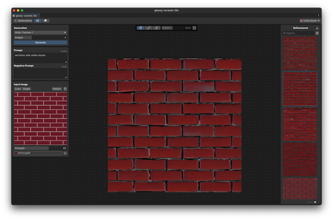

# Generate from a reference image

You can generate textures guided by the color, shape, or pattern of a reference image.

## Import a reference image

A reference image can be an image in the **Generations** panel, in the **Project** window, in the **Scene** view, or anywhere on your computer. The supported image formats are .png and .jpg.

To use an image in the **Generations** panel:

- Right-click the image and select **Set as Reference**.
- Drag the image directly to the **Input Image** panel.

To use an image from the **Project** window:

- Right-click the image in the **Project** window and select **Open in Muse**.
- Drag the image directly to the **Input Image** panel.

To import other images:

- In the **Input Image** panel, select **Import** and choose the image file.
- Drag the image directly to the **Input Image** panel.

## Generate based on color

You can generate textures that match the color of a reference image or a reference color.

1. In the **Input Image** panel, select the **Color** tab.
1. Do the following:

    - To use a reference image, import the image.
    - To use a reference color, use the **Color picker** to set a color.
1. To control how closely the generated textures follow the reference color, move the **Strength** slider. Higher values result in closer color matching.
1. In the **Prompt** field, write a prompt that describes the texture you want to generate.
1. In the **Negative Prompt** field, write a prompt that describes the elements to exclude from the generated textures.
1. To set the number of images to generate, move the **Images** slider.
1. Select **Generate**. The generated textures appear in the **Generations** panel.

## Generate based on shape

You can generate textures that resemble the shape of a pattern. A pattern, in this context, is a black-and-white image that has a repeatable design. The resulting textures maintain a unified appearance influenced by the white portions of the pattern image.

You can use a pattern provided by the tool or import a [canny](https://en.wikipedia.org/wiki/Canny_edge_detector) image. 

> [!NOTE]
> A canny image is a black-and-white image that has been processed to highlight the edges of objects. If you use a canny image, ensure that the lines align with pixels. If the image is blurry, it might not work well.

You can also control the strength of the generated textures, and set the color to guide the generation.

1. In the **Input Image** panel, select the **Shape** tab.
1. Do the following:

    - To use a reference pattern, select **Patterns** and select a pattern from the list. 
    - To use a canny image, import the image.
1. To control how strong the generated textures follow the reference pattern, move the **Strength** slider. Higher values result in closer pattern matching.
1. To set the color of the generated textures, use the **Color picker**.
1. In the **Prompt** field, write a prompt that describes the texture you want to generate.
1. In the **Negative Prompt** field, write a prompt that describes the elements to exclude from the generated textures.
1. To set the number of images to generate, move the **Images** slider.
1. Select **Generate**. The generated textures appear in the **Generations** panel.

## Additional resources

* [Refine with masking](xref:refine-with-masking)
* [Upscale the generated texture](xref:upscale)
* [Create variations of the generated texture](xref:create-variations)
* [Generate textures](xref:generate)
