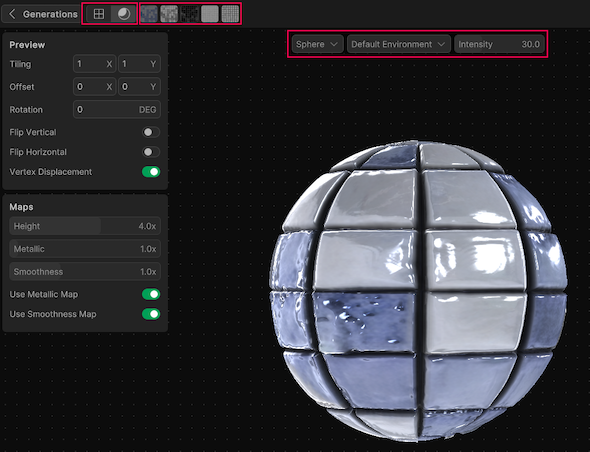

# Refine PBR materials

You can refine a PBR material to change the PBR maps. You can also view the PBR material in different lighting conditions and shapes.

To enter the Refinements branch, in the **Generations** panel, hover over the PBR sphere and select the **Refine** icon.

> [!TIP]
> You can also double-click the PBR sphere to enter the Refinements branch.

## Preview the PBR material

To preview the PBR material:

- To switch between the PBR material view and the generated texture view, select the **Material Preview** or **Artifact Prerview** icon.
- To preview the PBR material in different map modes, select a preview button.
- To view the PBR material in different shapes, choose a shape from the shape selection controls.
- To view the PBR material in different environment, choose a lighting condition from the environment selection controls.
- To view the PBR material in different lighting conditions, use the Intensity slider to specify the intensity of the light source.

## Edit the Preview settings

By default, vertex displacement is enabled for your PBR material. Vertex displacement is a method that controls the positions of a mesh's vertices through a shader. You can use vertex displacement to create effects such as water, distorted surfaces, terrain manipulation, explosions, fragmentation, and many more. However, if you don't need this effect, you can disable it to improve the performance of the PBR material.

To change the **Preview** settings:

- To tile the map, use the **Tiling** control to specify the Tile X and Tile Y coordinates.
- To offset the map, use the **Offset** control to specify the Offset X and Offset Y coordinates.
- To rotate the map, use the **Rotation** control to specify the rotation angle.
- To flip the map vertically, enable **Flip Vertical**.
- To flip the map horizontally, enable **Flip Horizontal**.
- To disable the vertex displacement, disable **Vertex Displacement**.

## Edit the Maps settings

By default, the metallic and smoothness maps are enabled, which allows you to change the metallic or smoothness intensities of the material to more than 100%. However, you can disable them for certain materials that don't require them. For example, you might want to disable the metallic map for medals to get a better effect.

To change the **Maps** settings:

- To change the grayscale values of the material, move the **Height** slider. For more information about height mapping, refer to [Heightmap](https://docs.unity3d.com/Manual/StandardShaderMaterialParameterHeightMap.html).
- To change the metallic intensity of the material, move the **Metallic** slider. For more information about Metallic, refer to [Metallic mode: Metallic Property](https://docs.unity3d.com/Manual/StandardShaderMaterialParameterMetallic.html).
- To change the smoothness intensity of the material, move the **Smoothness** slider. For more information about smoothness, refer to [Smoothness](https://docs.unity3d.com/Manual/StandardShaderMaterialParameterSmoothness.html).
- To disable the metallic map, disable **Metallic**. This allows you to change the metallic intensity to less than 100%.
- To disable the smoothness map, disable **Smoothness**. This allows you to change the smoothness intensity to less than 100%.

## Additional resources

* [View textures as PBR materials ](xref:view-as-pbr)
* [Smoothness](https://docs.unity3d.com/Manual/StandardShaderMaterialParameterSmoothness.html)
* [Metallic mode: Metallic Property](https://docs.unity3d.com/Manual/StandardShaderMaterialParameterMetallic.html)
* [Heightmap](https://docs.unity3d.com/Manual/StandardShaderMaterialParameterHeightMap.html)
* [Materials](https://docs.unity3d.com/Manual/Materials.html)
* [Smoothness](https://docs.unity3d.com/Manual/StandardShaderMaterialParameterSmoothness.html)
* [Shaders](https://docs.unity3d.com/Manual/Shaders.html)
