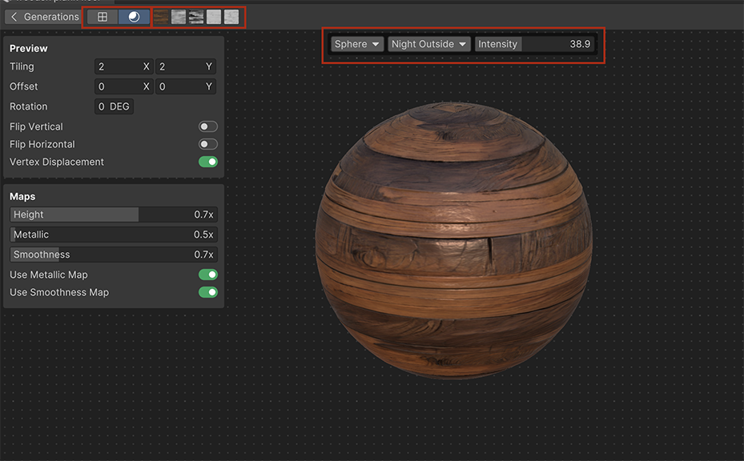

# Refine PBR materials

You can refine a PBR material to change the PBR maps. You can also view the PBR material in different lighting conditions and shapes.

To enter the Refinements branch, in the **Generations** panel, hover over the PBR sphere and select the **Refine** icon.

> [!TIP]
> You can also double-click the PBR sphere to enter the Refinements branch.

## Preview the PBR material

To preview the PBR material:

- To preview the PBR material in different map modes, select a preview button.
- To view the PBR material in different shapes, choose a shape from the shape selection controls.
- To view the PBR material in different lighting conditions, choose a lighting condition from the lighting selection controls.

## Edit the PBR material

To change the PBR preview settings:

- To tile the map, use the **Tiling** control to specify the Tile X and Tile Y coordinates.
- To offset the map, use the **Offset** control to specify the Offset X and Offset Y coordinates.
- To rotate the map, use the **Rotation** control to specify the rotation angle.
- To flip the map vertically, enable **Flip Vertical**.
- To flip the map horizontally, enable **Flip Horizontal**.

To change the PBR maps settings:

- To change the smoothness intensity of the material, move the **Roughness** slider. For more information about smoothness, see [Smoothness](https://docs.unity3d.com/Manual/StandardShaderMaterialParameterSmoothness.html).
- To change the metallic intensity of the material, move the **Metallic** slider. For more information about Metallic, see [Metallic mode: Metallic Property](https://docs.unity3d.com/Manual/StandardShaderMaterialParameterMetallic.html).
- To change the grayscale values of the material, move the **Height** slider. For more information about height mapping, see [Heightmap](https://docs.unity3d.com/Manual/StandardShaderMaterialParameterHeightMap.html).

## Additional resources

* [View textures as PBR materials ](xref:view-as-pbr)
* [Smoothness](https://docs.unity3d.com/Manual/StandardShaderMaterialParameterSmoothness.html)
* [Metallic mode: Metallic Property](https://docs.unity3d.com/Manual/StandardShaderMaterialParameterMetallic.html)
* [Heightmap](https://docs.unity3d.com/Manual/StandardShaderMaterialParameterHeightMap.html)
* [Materials](https://docs.unity3d.com/Manual/Materials.html)
