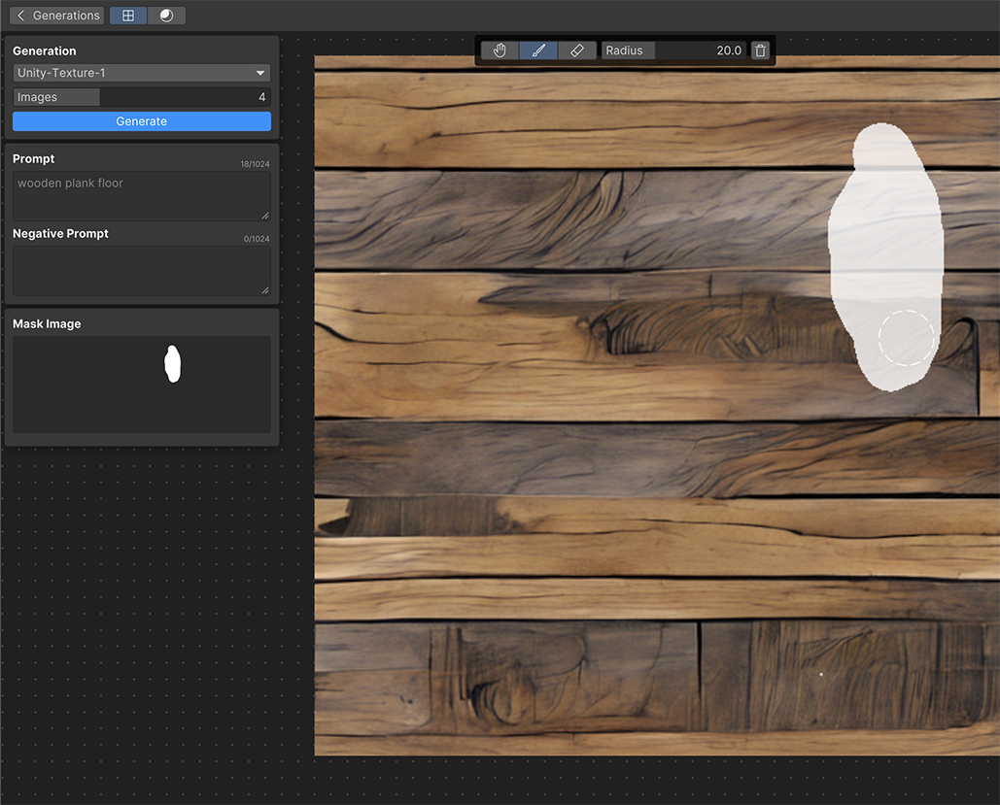

# Refine with masking

Masking provides enhanced control over the output.

## Refine a texture

Use a mask to refine any part of a generated texture. 

1. In the **Generations** panel, hover over the texture and select the **Refine** icon to enter the Refinements branch.

   > [!TIP]
   > You can also double-click a generated texture to enter the Refinements branch.

1. To activate the masking brush, select the **Paint** icon. For more information about the masking tools, refer to [Refine panel](xref:ui-elements#refine-panel) reference and [keyboard shortcuts](xref:keyboard-shortcuts#refine-panel).
1. Paint a mask over the area that you want to refine.

    
1. Enter a prompt that describes the desired refinement.
1. Select **Generate**. This regenerates textures in the masked area.

## Set as thumbnail

To set a refined texture as the thumbnail in the **Generations** panel for the Refinements branch, in the **Refinements** panel, right-click the texture and select **Set as Thumbnail**.

To re-enter the Refinements branch from the  **Generations** panel, double-click the thumbnail.

## Create a new refinement branch

To create a new refinement branch from a refined texture, in the **Refinements** panel, right-click the texture and select **Branch**. This adds the selected texture to the **Generations** panel and creates a new refinement branch with the selected texture as the root.

## Additional resources

* [Set as a reference image](xref:set-as-reference)
* [Upscale the generated texture](xref:upscale)
* [Create variations of the generated texture](xref:create-variations)
* [Generate textures](xref:generate)